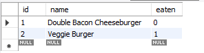

# The Burger Place

## Table of Contents
- [Description](#description)
- [Usage](#usage)
- [How It Works](#how-it-works)
    - [Database](#database)
    - [Handlebars](#handlebars)


## Description
The Burger Place is an application to demonstrate the use of a Model-View-Control(MVC) pipeline. The application itself is simple. Type the name of a burger to order it, once it's ready to eat you can either eat it or send it back to the kitchen. All eaten burgers will appear on the right hand side list.

## Usage
When you load the website, you will be presented with a text input box and a list of burgers ready to eat and burgers already eaten. Type in a burger that you want to order and press the order button. Once it's ready to eat, click the button to eat it and it will move to the eaten column. Delete from either columns by pressing the appropriate button.


## How It Works

### Database
The application uses a mySQL database to store the burger information. The deployed application uses the JawsDB mySQL add-on for heroku. The database itself is very simple and stores the id, name and whether or not a burger has been eaten. 



### Handlebars
Handlebars is used to handle the views. The main file contains links to bootstrap, css and javascript files. The index contains the main layout of the page and the burger-block file is for storing the list items for each burger. The burger-blocks uses if/else statements to determine whether or not a burger has been eaten to decide which buttons to display.
```
<li class="m-2 list-group-item bg-danger">
    <div class="row">
        <div class="col text-center">
            {{name}}
        </div>
    </div>
    <div class="row">
        <div class="col text-center">
            {{#if eaten}}
    <button class="eat-burger btn btn-warning" data-id="{{id}}">
        Eat The Burger
    </button> 
    <button class="return-burger btn btn-warning" data-id="{{id}}">Send It Back</button>
    {{else}}
    <button class="return-burger btn btn-warning" data-id="{{id}}">Delete</button>
    {{/if}}
        </div>
    </div>
</li>
```